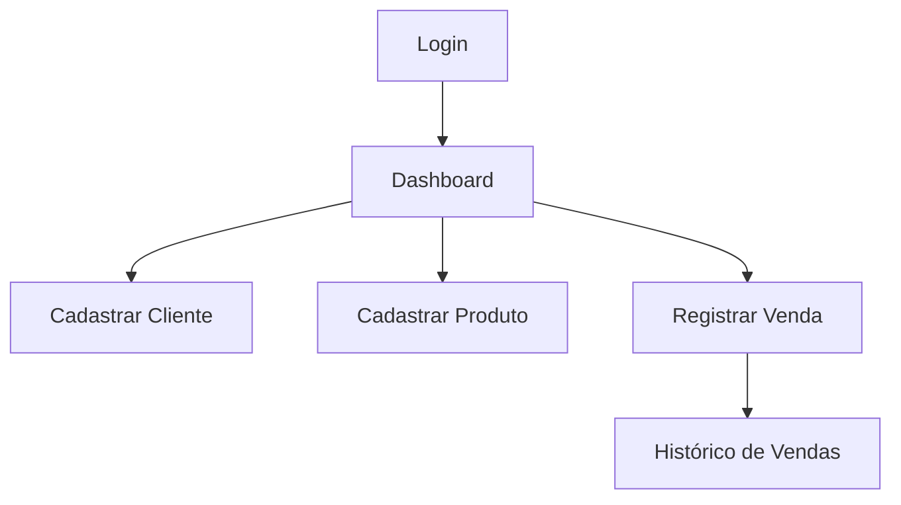

# 📊 Sistema de Vendas a Prazo

*Dashboard, Cadastro de Clientes, Produtos e Registro de Vendas*

---

## 📋 Sobre o Projeto
Sistema completo para gerenciamento de vendas parceladas, com:
- **Cadastro de clientes** (CPF/CNPJ, endereço, telefone)
- **Controle de produtos** (código, preço, estoque)
- **Registro de vendas** (parcelamento, histórico)
- **Dashboard intuitivo** com métricas rápidas

---

## 🛠️ Tecnologias e Justificativa de Escolhas

| Tecnologia          | Justificativa                                                                                     |
|---------------------|--------------------------------------------------------------------------------------------------|
| **Bootstrap 5**     | Framework CSS que acelera o desenvolvimento com componentes prontos, responsividade nativa e fácil customização via `style.css`. Ideal para sistemas internos que precisam de UI profissional sem complexidade. |
| **JavaScript Vanilla** | Mantém o projeto leve sem dependências desnecessárias, suficiente para a lógica atual.           |
| **HTML Semântico**  | Melhora acessibilidade e SEO (caso o sistema seja público).                                      |
| **Ícones (Bootstrap Icons)** | Biblioteca leve que adiciona elementos visuais intuitivos sem impacto no desempenho.             |

**Por que não usar React/Vue?**  
- O sistema não requer estados complexos ou atualizações em tempo real.
- Bootstrap já resolve 90% das necessidades de UI com menor custo de manutenção.

---

## ⚙️ Dependências
Todas via CDN (sem necessidade de instalação local):
```html
<!-- Bootstrap CSS -->
<link href="https://cdn.jsdelivr.net/npm/bootstrap@5.3.3/dist/css/bootstrap.min.css" rel="stylesheet">

<!-- Bootstrap Icons -->
<link rel="stylesheet" href="https://cdn.jsdelivr.net/npm/bootstrap-icons@1.10.0/font/bootstrap-icons.css">

<!-- Bootstrap JS (Bundle com Popper) -->
<script src="https://cdn.jsdelivr.net/npm/bootstrap@5.3.3/dist/js/bootstrap.bundle.min.js"></script>
```

---

## 🚀 Como Executar Localmente

### Pré-requisitos
- Navegador moderno (Chrome, Firefox, Edge)
- Servidor local (opcional para evitar problemas com CORS)

### Passo a Passo
1. **Clone o repositório**:
   ```bash
   git clone https://github.com/SAUL-ALVES/Sistema_de_Vendas_a_Prazo.git
   cd Sistema_de_Vendas_a_Prazo
   ```

2. **Execute com um servidor local** (recomendado):
   - **VS Code**: Instale a extensão "Live Server" e abra `index.html`.
   - **Node.js**:
     ```bash
     npx serve
     ```
     Acesse: `http://localhost:3000`

3. **Acesso direto** (sem servidor):
   - Abra o arquivo `index.html` no navegador.

---

## 📂 Estrutura de Arquivos
```plaintext
/
├── index.html          # Tela de login
├── dashboard.html      # Página principal
├── clientes.html       # Cadastro de clientes
├── produtos.html       # Cadastro de produtos
├── vendas.html         # Registro de vendas
├── style.css           # Estilos customizados
└── README.md           # Documentação
```

---

## 🎨 Design e Componentes
- **Cores Principais**:
  - Azul escuro (`#2c3e50`) para navbar e títulos
  - Verde (`#27ae60`) para ações positivas (cadastros)
  - Azul claro (`#3498db`) para botões primários

- **Componentes Reutilizáveis**:
  - Navbar consistente em todas as páginas
  - Modais para formulários (evitando redirecionamentos)
  - Cards com hover effects no dashboard

---

## 🔄 Fluxo do Sistema


---

## 📌 Melhorias Futuras
- [ ] Adicionar autenticação real com JWT
- [ ] Integrar com banco de dados (Firebase ou MySQL)
- [ ] Gerar relatórios em PDF
- [ ] Versão mobile com menu hamburguer

---

## 🤝 Como Contribuir
1. Faça um fork do projeto
2. Crie uma branch: `git checkout -b minha-feature`
3. Commit suas alterações: `git commit -m 'Adicionei X'`
4. Push para a branch: `git push origin minha-feature`
5. Abra um Pull Request

---

## 📄 Licença
MIT © Saul. Consulte o arquivo [LICENSE](LICENSE) para detalhes.

---

## ✉️ Contato
**Email**: saulalves55@gmail.com

---
